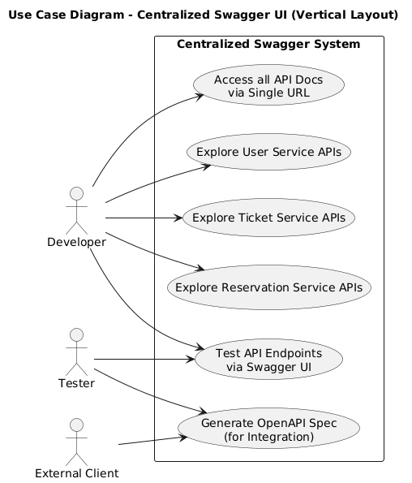
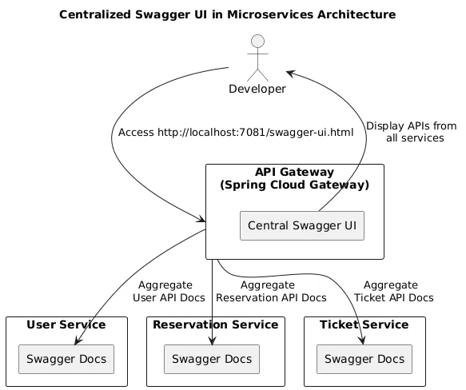
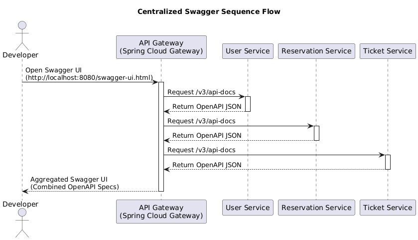

<h1 align="center" style="color:#4CAF50;">🚀 Central Swagger Gateway</h1>

  <b>A unified Swagger UI for all microservices via Spring Cloud Gateway</b> 
  Modernized with Spring Boot 3.5.0 & Java 22

  

## 📋  Use-case Diagram | Architecture Diagram | Sequence Diagram

  <strong>Use-case Diagram</strong> 
  

  <strong>Architecture Diagram</strong> 
  

  <strong>Sequence Diagram</strong> 
  

---

## 📋 Prerequisites

<li> Java 22 - Required JDK version</li>
<li> Maven 3.8+ - For dependency management and build</li>
<li> Spring Boot 3.5.0 - Application framework</li>
<li> Spring Cloud 2025.0.0 - Cloud-native patterns and services</li>

## 🛠️ Technology Stack

<li> Spring Boot: 3.5.0</li>
<li> Spring Cloud: 2025.0.0</li>
<li> Spring Cloud Gateway: WebFlux-based reactive gateway</li>
<li> Java: 22</li>
<li> Build Tool: Maven</li>

---

## 📘 Swagger UI
After the service starts, access the Swagger UI at:
http://localhost:7081/swagger-ui/index.html

## 🧭 Usage
Open the Swagger UI URL in your browser.

In the top-right corner, use the “Select a definition” dropdown.

Choose the desired service (e.g., gateway-service).

Explore all available API endpoints via the central Swagger interface.

This central gateway helps consolidate API documentation from all microservices into a single, interactive interface.

| Contributor                         | Role & Contributions                                                                                                                     |
| ----------------------------------- | ---------------------------------------------------------------------------------------------------------------------------------------- |
| **Oguz Tapol**                      | 🔹 Initial Setup                                                                                                                     |
|                                     |  – Java 11                                                                                                                           |
|                                     |  – Spring Boot 2.7.4                                                                                                                 |
|                                     |  – Spring Cloud 2021.0.4                                                                                                             |
|                                     |  – `spring-cloud-starter-gateway`                                                                                                        | 
| **Shreeson Shrestha (darkassasin)** | 🔹 Project Upgrade                                                                                                                   |
|                                     |  – Java 22                                                                                                                           |
|                                     |  – Spring Boot 3.5.0                                                                                                                 |
|                                     |  – Spring Cloud 2025.0.0                                                                                                             |
|                                     |  – `spring-cloud-starter-gateway-server-webflux`                                                                                         | 
|                                     |  - `springdoc-openapi-starter-webflux-ui`                                                                                                |
|                                     |  - `springdoc-openapi-starter-webflux-api`                                                                                                |

## Future Improvements
<li> Spring Security Integrations for accesing documentations</li>
<li> Improvement with Docker containerizations and deployment</li>
