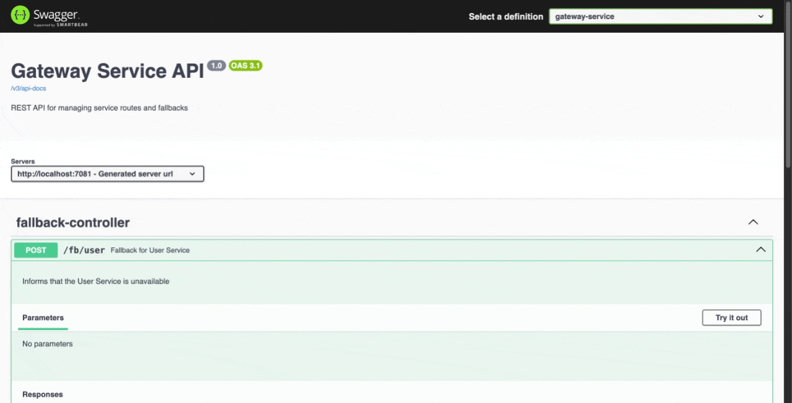

<h1 align="center" style="color:#4CAF50;">🚀 Central Swagger Gateway</h1>

  <b>A unified Swagger UI for all microservices via Spring Cloud Gateway</b> 
  Modernized with Spring Boot 3.5.0 & Java 22

  

---

## 🛠 Tech Stack

- Java 22  
- Spring Boot 3.5.0  
- Spring Cloud 2025.0.0  
- Maven  
- `spring-cloud-starter-gateway-server-webflux`

---

## 📘 Swagger UI
After the service starts, access the Swagger UI at:
http://localhost:7081/swagger-ui/index.html

## 🧭 Usage
Open the Swagger UI URL in your browser.

In the top-right corner, use the “Select a definition” dropdown.

Choose the desired service (e.g., gateway-service).

Explore all available API endpoints via the central Swagger interface.

This central gateway helps consolidate API documentation from all microservices into a single, interactive interface.

| Contributor                         | Role & Contributions                                                                                                                     |
| ----------------------------------- | ---------------------------------------------------------------------------------------------------------------------------------------- |
| **Oguz Tapol**                      | 🔹 Initial Setup                                                                                                                     |
|                                     |  – Java 11                                                                                                                           |
|                                     |  – Spring Boot 2.7.4                                                                                                                 |
|                                     |  – Spring Cloud 2021.0.4                                                                                                             |
|                                     |  – `spring-cloud-starter-gateway`                                                                                                        | 
| **Shreeson Shrestha (darkassasin)** | 🔹 Project Upgrade                                                                                                                   |
|                                     |  – Java 22                                                                                                                           |
|                                     |  – Spring Boot 3.5.0                                                                                                                 |
|                                     |  – Spring Cloud 2025.0.0                                                                                                             |
|                                     |  – `spring-cloud-starter-gateway-server-webflux`                                                                                         |

